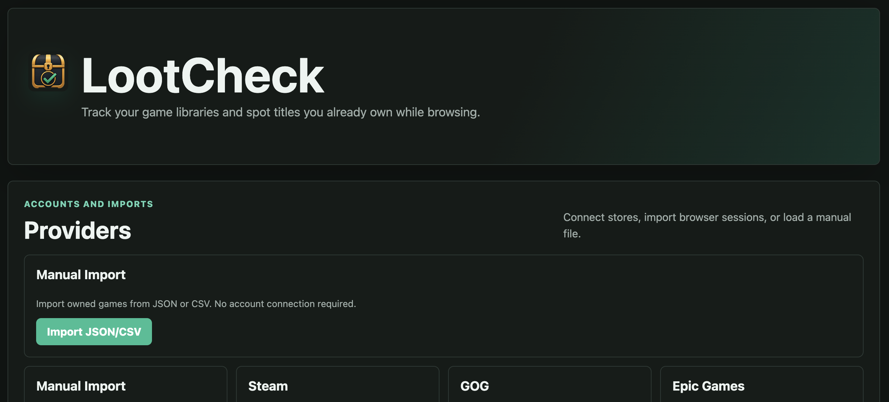
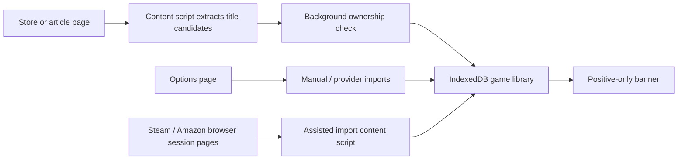

# LootCheck



LootCheck is a Firefox extension that keeps a local game library and shows a small ownership banner when you browse a game you already own. It is built for people with libraries spread across Steam, GOG, Epic Games, Amazon Games, and manual exports.

<p>
  
  
  
  
</p>

## What It Does

| Area | Behavior |
| --- | --- |
| Ownership banner | Shows only when a local match is found. No negative “not owned” banners. |
| Library browser | Stores imported games in IndexedDB inside the extension. |
| Matching | Uses normalized exact, alias, and conservative high-confidence fuzzy matching. |
| Browser imports | Reads user-opened Steam and Amazon library pages through content scripts. |
| Store sync | Supports GOG and Epic import flows, plus Steam API-key sync when configured. |
| Manual import | Accepts JSON or CSV with titles, aliases, platforms, tags, and playtime fields. |

## Provider Status

| Provider | Import path | Notes |
| --- | --- | --- |
| Manual | JSON / CSV | No account connection required. |
| Steam | Browser-session import or optional Web API key | Browser import does not require the user to provide an API key. |
| GOG | Browser-session account check and library import | Uses the user’s normal GOG browser session. |
| Epic Games | Authorization-code flow | Tokens are stored locally in IndexedDB. |
| Amazon Games | Browser-session import from Luna / Prime Gaming collection pages | Cycles collection year filters, imports each completed batch, then exports a complete JSON snapshot. |

## Privacy Model

LootCheck keeps account and library data in browser extension storage:

- No analytics.
- No external backend.
- No password capture.
- No browser cookie scraping.
- Store/library data remains in the extension’s IndexedDB.
- Diagnostics and exports avoid tokens, credentials, and raw provider responses by default.

## Quick Start

Download the latest packaged builds from GitHub Releases:

- [Download Firefox package](https://github.com/kgupta21/LootCheck/releases/latest/download/lootcheck-firefox.zip)
- [Download Chrome package](https://github.com/kgupta21/LootCheck/releases/latest/download/lootcheck-chrome.zip)

For local development builds:

```sh
npm install
npm run typecheck
npm test
npm run build
```

Load the Firefox development build:

1. Open Firefox.
2. Go to `about:debugging`.
3. Select **This Firefox**.
4. Click **Load Temporary Add-on**.
5. Choose `dist-firefox/manifest.json`.

Load the Chrome development build:

1. Open Chrome.
2. Go to `chrome://extensions`.
3. Enable **Developer mode**.
4. Click **Load unpacked**.
5. Choose the `dist-chrome/` folder.

## Common Workflows

### Import a Small Manual Library

```json
[
  {
    "title": "Baldur's Gate 3",
    "source": "manual",
    "aliases": ["Baldurs Gate III"],
    "platforms": ["PC"]
  },
  {
    "title": "Hades",
    "source": "manual",
    "platforms": ["PC"]
  }
]
```

### Import Steam Without an API Key

1. Open LootCheck settings.
2. In the Steam card, click **Open Steam login / library**.
3. Sign in normally on Steam if needed.
4. Click **Import from current Steam session**.

### Import Amazon Games

1. Open LootCheck settings.
2. In the Amazon Games card, click **Open Amazon Games login / library**.
3. Sign in normally on Amazon / Luna.
4. Click **Import from current Amazon session**.
5. LootCheck cycles collection filters, imports each finished batch, then downloads a complete JSON export.

## Architecture



## Build Output

`npm run build` emits browser-specific extension folders and zip packages:

```text
dist-firefox/
  manifest.json
  assets/
  background/
  content/
  options/
dist-chrome/
  manifest.json
  assets/
  background/
  content/
  options/
packages/
  lootcheck-firefox.zip
  lootcheck-chrome.zip
```

The Firefox build keeps `background.scripts`; the Chrome build converts the manifest to `background.service_worker` and removes Firefox-specific manifest metadata.

## Host Permissions

LootCheck requests store-specific host permissions so background scripts and assisted content scripts can run only where needed:

- Steam: `steamcommunity.com`, `store.steampowered.com`, `partner.steam-api.com`
- GOG: `gog.com`, `menu.gog.com`
- Epic Games: Epic account, catalog, and library service hosts
- Amazon Games: `gaming.amazon.com`, `luna.amazon.com`, `luna.amazon.ca`, `amazon.com`, `amazon.ca`

## Development Notes

- Keep automated tests offline; provider APIs are mocked with fixtures.
- Do not commit `dist-*`, `packages/`, tokens, cookies, `.env` files, or browser profile data.
- Run `npm run typecheck`, `npm test`, and `npm run build` before pushing.
- To publish downloadable zip files, push a version tag such as `v0.1.0`; the release workflow uploads `lootcheck-firefox.zip` and `lootcheck-chrome.zip` to that GitHub release.

## Repository

GitHub: [kgupta21/LootCheck](https://github.com/kgupta21/LootCheck)

Project site: [kgupta21.github.io/LootCheck](https://kgupta21.github.io/LootCheck/)

The static promotional site lives in [`docs/`](docs/). GitHub Pages can publish it from
`main` using the included workflow, or directly from the `docs` folder in repository settings.

## License

Code is licensed under AGPL-3.0-or-later. LootCheck branding is reserved; see `TRADEMARK.md` and `COMMERCIAL_LICENSE.md`.
